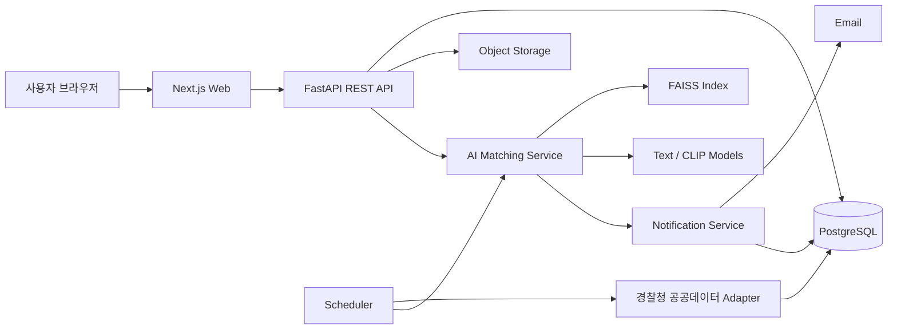

# ReFind 개발 명세서

> 공공 유실물 데이터를 활용한 AI 분실물 매칭·알림 웹 서비스
>
> 기준 문서: 2026 ICT 빌드업 캠프 ReFind 프로젝트 계획서

---

## 1. 개발 목표

사용자가 분실한 물건의 **물품명, 종류, 색상, 분실 장소, 분실 날짜, 설명, 사진**을 등록하면 경찰청 유실물 공공데이터의 습득물과 자동 비교하여 **가능성이 높은 후보 TOP 5**를 보여준다. 이후 신규 습득물이 들어오면 기존 분실물과 다시 매칭하고, 기준 점수 이상일 때 서비스 내 알림과 이메일을 보낸다.

### MVP 완료 기준

1. 회원가입·로그인 후 분실물을 등록할 수 있다.
2. 경찰청 습득물 API 데이터를 주기적으로 수집하고 중복 없이 저장한다.
3. 텍스트·카테고리·색상·지역·날짜를 이용해 매칭 점수를 계산한다.
4. 사진이 양쪽에 있을 때 이미지 유사도를 추가한다.
5. 분실물별 추천 후보 TOP 5와 점수 근거를 확인할 수 있다.
6. 신규 후보가 알림 기준을 넘으면 이메일 또는 서비스 내 알림을 한 번만 발송한다.
7. 배포된 웹에서 등록 → 매칭 → 상세 조회 → 알림 흐름을 시연할 수 있다.

### 이번 MVP에서 제외하거나 뒤로 미룰 기능

- 카카오 알림톡, 모바일 앱 푸시
- 지도 좌표를 이용한 정밀 거리 계산
- 기관별 과금·구독 기능
- 복잡한 관리자 권한 체계
- 중고거래 사이트 크롤링
- 사용자 간 실시간 채팅

관리자 기능은 **습득물 직접 등록, 목록 조회, 상태 변경**까지만 구현한다.

---

## 2. 확정 기술 스택

| 영역 | 기술 |
|---|---|
| 프론트엔드 | Next.js, TypeScript, Tailwind CSS |
| 백엔드 | FastAPI, Pydantic, SQLAlchemy, Alembic |
| 데이터베이스 | PostgreSQL |
| 인증 | JWT Access/Refresh Token |
| 파일 저장 | S3 호환 Object Storage |
| 텍스트 모델 | 한국어 지원 Sentence-Transformer 모델 |
| 이미지 모델 | CLIP 이미지 임베딩 모델 |
| 벡터 검색 | FAISS `IndexFlatIP` |
| 비동기 작업 | 백그라운드 Worker 또는 정기 실행 Scheduler |
| 프론트 배포 | Vercel |
| API·Worker 배포 | 장기 실행과 스케줄 작업이 가능한 별도 서버 |
| 협업 | GitHub, Notion, Figma |

### 기본 모델 설정

- 텍스트 베이스라인: `sentence-transformers/paraphrase-multilingual-MiniLM-L12-v2`
- 이미지 베이스라인: `openai/clip-vit-base-patch32`
- 모델 이름은 환경변수로 관리해 교체 가능하게 만든다.

---

## 3. 시스템 구조



### 주요 처리 흐름

1. 사용자가 분실물을 등록한다.
2. 백엔드가 입력값을 정규화하고 텍스트·이미지 임베딩을 생성한다.
3. 공공데이터에서 수집한 습득물 중 1차 후보를 필터링한다.
4. FAISS로 텍스트 유사 후보를 가져온다.
5. 텍스트, 이미지, 카테고리, 색상, 장소, 날짜 점수를 계산한다.
6. 최종 점수순으로 정렬하고 상위 후보를 저장한다.
7. 사용자 화면에는 TOP 5와 추천 근거를 보여준다.
8. 신규 습득물 수집 후 활성 상태의 분실물과 재매칭한다.
9. 알림 기준을 넘은 새로운 매칭만 알림을 보낸다.

---

## 4. 사용자 역할

### 일반 사용자

- 회원가입·로그인
- 분실물 등록·조회·수정·종료
- 추천 후보 TOP 5 조회
- 습득물 상세 정보 및 원본 출처 확인
- 알림 확인

### 관리자

- 공공데이터 수집 상태 확인
- 기관 자체 습득물 등록
- 습득물 상태 변경: `보관중`, `반환완료`, `폐기`
- 재매칭 수동 실행

---

## 5. 화면 명세

### 5.1 라우트

| 경로 | 화면 | 우선순위 |
|---|---|---|
| `/` | 서비스 소개 및 분실물 등록 시작 | P0 |
| `/login` | 로그인 | P0 |
| `/signup` | 회원가입 | P0 |
| `/lost/new` | 단계형 분실물 등록 | P0 |
| `/lost` | 내 분실물 목록 | P0 |
| `/lost/[id]` | 분실물 상세·수정·종료 | P0 |
| `/lost/[id]/matches` | 추천 후보 TOP 5 | P0 |
| `/found/[id]` | 습득물 상세 | P0 |
| `/notifications` | 알림 목록 | P1 |
| `/admin/found-items` | 관리자 습득물 관리 | P2 |
| `/admin/sync` | 공공데이터 수집 이력 | P2 |

### 5.2 분실물 등록 단계

#### Step 1. 물건 정보

- 물품명: 필수, 2~100자
- 카테고리: 필수
- 색상: 선택, 복수 선택 가능

#### Step 2. 분실 시점·장소

- 분실 날짜: 필수, 미래 날짜 불가
- 시·도 / 시·군·구: 필수
- 상세 장소: 선택, 200자 이하

#### Step 3. 상세 설명

- 특징 설명: 선택, 1,000자 이하
- 브랜드·모델명·각인·스크래치 등 구체적인 특징 입력 안내

#### Step 4. 사진·확인

- 사진: 선택, JPG/PNG/WEBP
- 최대 10MB
- 입력 내용 최종 확인 후 등록

### 5.3 추천 결과 카드

필수 표시 항목:

- 습득물 이미지
- 물품명
- 습득 날짜
- 습득 장소
- 보관 장소
- 종합 매칭 점수
- 추천 근거 최대 3개
- 상세보기 버튼
- 원본 공공데이터 출처

> 화면에 표시하는 점수는 AI의 확정 확률이 아니라 여러 유사도 값을 합친 **매칭 점수**다. UI에서 “찾을 확률 87%”처럼 표현하지 않고 “매칭 점수 87점”으로 표시한다.

---

## 6. 데이터베이스 명세

모든 기본키는 UUID를 사용하고, 날짜·시간은 UTC로 저장한다.

### 6.1 `users`

| 필드 | 타입 | 제약 |
|---|---|---|
| `id` | UUID | PK |
| `email` | VARCHAR(255) | UNIQUE, NOT NULL |
| `password_hash` | VARCHAR | NOT NULL |
| `name` | VARCHAR(50) | NOT NULL |
| `role` | ENUM | `USER`, `ADMIN` |
| `created_at` | TIMESTAMPTZ | NOT NULL |
| `updated_at` | TIMESTAMPTZ | NOT NULL |

### 6.2 `lost_items`

| 필드 | 타입 | 설명 |
|---|---|---|
| `id` | UUID | PK |
| `user_id` | UUID | FK → users |
| `title` | VARCHAR(100) | 사용자가 입력한 물품명 |
| `category_code` | VARCHAR(50) | 내부 표준 카테고리 |
| `color_codes` | JSONB | 표준 색상 코드 배열 |
| `lost_date` | DATE | 분실 날짜 |
| `region_code` | VARCHAR(20) | 행정구역 코드 |
| `place_text` | VARCHAR(200) | 상세 장소 |
| `description` | TEXT | 특징 설명 |
| `image_url` | TEXT | 사용자 사진 |
| `status` | ENUM | `ACTIVE`, `FOUND`, `CLOSED` |
| `normalized_text` | TEXT | AI 입력용 정규화 문장 |
| `text_embedding` | BYTEA/FLOAT4[] | 텍스트 벡터 |
| `image_embedding` | BYTEA/FLOAT4[] | 이미지 벡터, 선택 |
| `created_at` | TIMESTAMPTZ | 생성일 |
| `updated_at` | TIMESTAMPTZ | 수정일 |

인덱스:

- `(user_id, status)`
- `(category_code, lost_date)`
- `(region_code)`

### 6.3 `found_items`

| 필드 | 타입 | 설명 |
|---|---|---|
| `id` | UUID | PK |
| `source` | VARCHAR(30) | `LOST112`, `INSTITUTION` |
| `source_item_id` | VARCHAR(100) | 원본 데이터 식별자 |
| `title` | VARCHAR(200) | 습득물명 |
| `category_code` | VARCHAR(50) | 내부 표준 카테고리 |
| `color_codes` | JSONB | 추출·정규화된 색상 |
| `found_date` | DATE | 습득 날짜 |
| `region_code` | VARCHAR(20) | 습득 지역 |
| `place_text` | VARCHAR(300) | 습득 장소 |
| `storage_place` | VARCHAR(300) | 보관 장소 |
| `contact_text` | VARCHAR(200) | 문의 정보 |
| `description` | TEXT | 상세 설명 |
| `image_url` | TEXT | 원본 이미지 URL |
| `detail_url` | TEXT | 원본 상세 페이지 |
| `status` | ENUM | `STORED`, `RETURNED`, `DISPOSED`, `UNKNOWN` |
| `normalized_text` | TEXT | AI 입력용 정규화 문장 |
| `text_embedding` | BYTEA/FLOAT4[] | 텍스트 벡터 |
| `image_embedding` | BYTEA/FLOAT4[] | 이미지 벡터, 선택 |
| `raw_payload` | JSONB | 원본 API 응답 |
| `collected_at` | TIMESTAMPTZ | 최초 수집 시각 |
| `updated_at` | TIMESTAMPTZ | 마지막 갱신 시각 |

제약 및 인덱스:

- `UNIQUE(source, source_item_id)`
- `(found_date, category_code)`
- `(region_code)`
- `(status)`

### 6.4 `matches`

| 필드 | 타입 | 설명 |
|---|---|---|
| `id` | UUID | PK |
| `lost_item_id` | UUID | FK |
| `found_item_id` | UUID | FK |
| `text_score` | DECIMAL(5,4) | 0~1 |
| `image_score` | DECIMAL(5,4) | nullable |
| `category_score` | DECIMAL(5,4) | nullable |
| `color_score` | DECIMAL(5,4) | nullable |
| `location_score` | DECIMAL(5,4) | nullable |
| `date_score` | DECIMAL(5,4) | nullable |
| `final_score` | DECIMAL(5,4) | 0~1 |
| `reason_codes` | JSONB | 추천 근거 코드 배열 |
| `notified_at` | TIMESTAMPTZ | 알림 발송 시각 |
| `created_at` | TIMESTAMPTZ | 생성 시각 |
| `updated_at` | TIMESTAMPTZ | 갱신 시각 |

제약 및 인덱스:

- `UNIQUE(lost_item_id, found_item_id)`
- `(lost_item_id, final_score DESC)`
- `(found_item_id)`

### 6.5 `notifications`

| 필드 | 타입 | 설명 |
|---|---|---|
| `id` | UUID | PK |
| `user_id` | UUID | FK |
| `lost_item_id` | UUID | FK |
| `match_id` | UUID | FK |
| `channel` | ENUM | `IN_APP`, `EMAIL` |
| `status` | ENUM | `PENDING`, `SENT`, `FAILED`, `READ` |
| `sent_at` | TIMESTAMPTZ | 발송 시각 |
| `read_at` | TIMESTAMPTZ | 읽은 시각 |
| `error_message` | TEXT | 실패 사유 |
| `created_at` | TIMESTAMPTZ | 생성 시각 |

### 6.6 `sync_runs`

| 필드 | 타입 | 설명 |
|---|---|---|
| `id` | UUID | PK |
| `source` | VARCHAR(30) | 데이터 출처 |
| `started_at` | TIMESTAMPTZ | 시작 |
| `finished_at` | TIMESTAMPTZ | 종료 |
| `status` | ENUM | `RUNNING`, `SUCCESS`, `FAILED` |
| `fetched_count` | INTEGER | 조회 건수 |
| `upserted_count` | INTEGER | 저장·갱신 건수 |
| `last_cursor` | VARCHAR | 다음 수집 기준 |
| `error_message` | TEXT | 오류 내용 |

---

## 7. 데이터 정규화 명세

### 7.1 텍스트 정규화

1. Unicode NFKC 정규화
2. 연속 공백 제거
3. 영문 소문자화
4. 의미 없는 특수문자 제거
5. 숫자, 브랜드명, 모델명은 유지
6. 색상 유사어를 표준 색상으로 치환
7. 물품명을 내부 카테고리로 매핑

AI에 넣을 최종 문장 예시:

```text
[카테고리] 지갑
[물품명] 검은색 카드지갑
[색상] 검정
[설명] 앞면에 작은 스크래치가 있고 내부에 학생증이 들어 있음
```

지역과 날짜는 별도 점수로 계산하므로 텍스트 임베딩 문장에는 기본적으로 넣지 않는다.

### 7.2 색상 표준화 예시

| 입력 표현 | 표준 코드 |
|---|---|
| 검정, 검은색, 블랙 | BLACK |
| 흰색, 하얀색, 화이트 | WHITE |
| 남색, 네이비 | NAVY |
| 베이지, 크림 | BEIGE |
| 회색, 그레이 | GRAY |

여러 색상이 있으면 배열로 저장하고 색상 점수는 교집합 비율로 계산한다.

### 7.3 카테고리 예시

- 지갑·카드지갑
- 휴대전화
- 이어폰·헤드폰
- 가방·파우치
- 신분증·카드
- 전자기기
- 의류
- 귀금속·시계
- 열쇠
- 기타

원본 API의 분류와 서비스 내부 분류를 연결하는 매핑 테이블을 코드가 아니라 설정 파일 또는 DB로 관리한다.

---

## 8. AI 매칭 명세

### 8.1 1차 후보 필터

다음 조건으로 전체 습득물 중 후보군을 줄인다.

1. 습득일이 분실일보다 이틀 이상 빠르면 제외한다.
2. 기본 검색 범위는 분실일 이후 180일까지로 한다.
3. 카테고리가 명확하게 다르면 제외한다.
4. 같은 시·도 후보를 우선 검색한다.
5. 같은 지역 후보가 부족하면 전국 범위로 확장한다.
6. 텍스트 FAISS 검색으로 상위 100개 후보를 가져온다.

### 8.2 개별 점수

#### 텍스트 점수

- 물품명, 카테고리, 색상, 설명을 문장 임베딩으로 변환한다.
- 벡터를 L2 정규화한다.
- FAISS Inner Product를 코사인 유사도로 사용한다.
- 최종 값은 0~1 범위로 제한한다.

#### 이미지 점수

- 사용자 이미지와 습득물 이미지가 모두 있을 때만 계산한다.
- CLIP 이미지 임베딩 간 코사인 유사도를 사용한다.
- 한쪽 이미지가 없으면 0점 처리하지 않고 해당 항목을 계산에서 제외한다.

#### 카테고리 점수

| 조건 | 점수 |
|---|---:|
| 정확히 동일 | 1.00 |
| 같은 상위 카테고리 | 0.75 |
| 한쪽이 미분류 | 계산 제외 |
| 명확히 불일치 | 후보 제외 |

#### 색상 점수

- 표준 색상 배열의 Jaccard 유사도를 사용한다.
- 예: `{BLACK, GRAY}`와 `{BLACK}` → `1/2 = 0.5`
- 한쪽에 색상 정보가 없으면 계산에서 제외한다.

#### 지역 점수

| 조건 | 점수 |
|---|---:|
| 같은 시·군·구 | 1.00 |
| 같은 시·도 | 0.75 |
| 다른 시·도 | 0.20 |
| 한쪽 지역 누락 | 계산 제외 |

#### 날짜 점수

| 습득일 - 분실일 | 점수 |
|---|---:|
| 0~1일 | 1.00 |
| 2~7일 | 0.90 |
| 8~30일 | 0.70 |
| 31~90일 | 0.40 |
| 91~180일 | 0.20 |
| 분실일보다 2일 이상 이전 | 후보 제외 |

### 8.3 최종 점수

초기 가중치:

| 항목 | 가중치 |
|---|---:|
| 텍스트 | 0.35 |
| 이미지 | 0.25 |
| 카테고리 | 0.15 |
| 색상 | 0.10 |
| 지역 | 0.10 |
| 날짜 | 0.05 |

정보가 없는 항목은 0점으로 넣지 않고 가중치를 다시 정규화한다.

```text
final_score = Σ(사용 가능한 점수 × 가중치) / Σ(사용 가능한 가중치)
```

예를 들어 이미지가 없으면 이미지 가중치 0.25를 제외하고 나머지 항목의 가중치 합 0.75로 나눈다.

### 8.4 점수 기준

| 점수 | 처리 |
|---|---|
| 0.78 이상 | 유력 후보, 알림 발송 대상 |
| 0.65~0.78 | 가능성 있는 후보, 결과 화면 표시 |
| 0.50~0.65 | TOP 5 자리가 남을 때만 표시 |
| 0.50 미만 | 기본 결과에서 제외 |

초기 임계값일 뿐이며 실제 검증 데이터로 조정한다.

### 8.5 추천 근거 생성

점수에 기여한 항목 중 높은 순서대로 최대 3개를 표시한다.

| 조건 | 문구 |
|---|---|
| `text_score >= 0.75` | 물품명과 상세 특징이 유사합니다. |
| `image_score >= 0.80` | 등록한 사진과 외형이 유사합니다. |
| `category_score == 1` | 물품 종류가 일치합니다. |
| `color_score >= 0.80` | 색상이 일치합니다. |
| `location_score >= 0.75` | 분실 장소와 가까운 지역에서 습득되었습니다. |
| `date_score >= 0.90` | 분실 시점과 가까운 날짜에 습득되었습니다. |

---

## 9. 공공데이터 수집 명세

### 9.1 Adapter 구조

공공 API 필드명을 서비스 전역에서 직접 사용하지 않는다.

```text
경찰청 API 응답
    ↓
Lost112Provider
    ↓
FoundItemDTO
    ↓
정규화·Upsert·임베딩 생성
    ↓
found_items
```

`FoundItemDTO` 필드:

```text
source_item_id
name
category_raw
found_date
region_raw
place_text
storage_place
contact_text
description
image_url
detail_url
raw_payload
```

### 9.2 수집 정책

- 최초 실행: 최근 6개월 데이터 수집
- 정기 실행: 마지막 성공 시점 이후 데이터를 조회
- 권장 주기: 6시간마다
- `(source, source_item_id)` 기준 Upsert
- 원본 데이터가 수정되면 내부 데이터도 갱신
- 신규 또는 변경 데이터만 임베딩 재생성
- 이미지 다운로드 실패 시 텍스트 데이터는 정상 저장
- 매 실행 결과를 `sync_runs`에 기록

### 9.3 재매칭 정책

신규 습득물 저장 후:

1. 상태가 `ACTIVE`인 분실물만 조회한다.
2. 신규 습득물과 기본 필터가 맞는 분실물만 계산한다.
3. 기존 `matches`가 있으면 점수를 갱신한다.
4. 처음으로 알림 기준을 넘은 매칭만 알림 큐에 넣는다.
5. 같은 매칭에 이메일을 중복 발송하지 않는다.

---

## 10. REST API 명세

Base URL: `/api/v1`

### 10.1 인증

| Method | Endpoint | 설명 |
|---|---|---|
| POST | `/auth/signup` | 회원가입 |
| POST | `/auth/login` | 로그인 |
| POST | `/auth/refresh` | Access Token 갱신 |
| GET | `/auth/me` | 현재 사용자 조회 |

### 10.2 분실물

| Method | Endpoint | 설명 |
|---|---|---|
| POST | `/lost-items` | 분실물 등록 |
| GET | `/lost-items` | 내 분실물 목록 |
| GET | `/lost-items/{lost_item_id}` | 상세 조회 |
| PATCH | `/lost-items/{lost_item_id}` | 수정 |
| DELETE | `/lost-items/{lost_item_id}` | 종료 처리, Soft Delete |
| POST | `/lost-items/{lost_item_id}/rematch` | 재매칭 요청 |
| GET | `/lost-items/{lost_item_id}/matches` | 추천 결과 조회 |

#### 분실물 등록 요청

이미지가 있으므로 `multipart/form-data`를 사용한다.

```text
title: 검은색 카드지갑
category_code: WALLET
color_codes: ["BLACK"]
lost_date: 2026-07-18
region_code: 29170
place_text: 조선대학교 중앙도서관 2층
description: 앞면에 작은 흠집, 내부에 학생증이 있음
image: wallet.jpg
```

#### 분실물 등록 응답

```json
{
  "id": "uuid",
  "status": "ACTIVE",
  "matching_status": "PROCESSING",
  "created_at": "2026-07-20T10:00:00Z"
}
```

### 10.3 추천 결과

`GET /lost-items/{id}/matches?limit=5`

```json
{
  "lost_item_id": "uuid",
  "generated_at": "2026-07-20T10:00:08Z",
  "items": [
    {
      "match_id": "uuid",
      "score": 0.8241,
      "score_label": "HIGH",
      "reasons": [
        "물품명과 상세 특징이 유사합니다.",
        "색상이 일치합니다.",
        "같은 지역에서 습득되었습니다."
      ],
      "score_breakdown": {
        "text": 0.86,
        "image": null,
        "category": 1.0,
        "color": 1.0,
        "location": 1.0,
        "date": 0.7
      },
      "found_item": {
        "id": "uuid",
        "title": "블랙 카드 케이스",
        "found_date": "2026-07-19",
        "place_text": "광주 동구 서석동",
        "storage_place": "동부경찰서",
        "image_url": "https://...",
        "source": "LOST112"
      }
    }
  ]
}
```

### 10.4 습득물

| Method | Endpoint | 설명 |
|---|---|---|
| GET | `/found-items/{found_item_id}` | 습득물 상세 조회 |

### 10.5 알림

| Method | Endpoint | 설명 |
|---|---|---|
| GET | `/notifications` | 내 알림 목록 |
| PATCH | `/notifications/{notification_id}/read` | 읽음 처리 |

### 10.6 관리자

| Method | Endpoint | 설명 |
|---|---|---|
| POST | `/admin/found-items` | 기관 습득물 등록 |
| PATCH | `/admin/found-items/{id}` | 상태 수정 |
| POST | `/admin/sync` | 공공데이터 수집 수동 실행 |
| GET | `/admin/sync-runs` | 수집 이력 조회 |

---

## 11. 백엔드 디렉터리 구조

```text
backend/
├─ app/
│  ├─ main.py
│  ├─ core/
│  │  ├─ config.py
│  │  ├─ security.py
│  │  └─ logging.py
│  ├─ api/
│  │  ├─ dependencies.py
│  │  └─ v1/
│  │     ├─ auth.py
│  │     ├─ lost_items.py
│  │     ├─ found_items.py
│  │     ├─ matches.py
│  │     ├─ notifications.py
│  │     └─ admin.py
│  ├─ models/
│  ├─ schemas/
│  ├─ repositories/
│  ├─ services/
│  │  ├─ lost_item_service.py
│  │  ├─ found_item_service.py
│  │  ├─ matching_service.py
│  │  ├─ notification_service.py
│  │  └─ sync_service.py
│  ├─ ai/
│  │  ├─ text_encoder.py
│  │  ├─ image_encoder.py
│  │  ├─ faiss_index.py
│  │  ├─ normalizer.py
│  │  ├─ scorer.py
│  │  └─ reason_builder.py
│  ├─ providers/
│  │  └─ lost112.py
│  ├─ workers/
│  │  ├─ sync_worker.py
│  │  └─ rematch_worker.py
│  └─ db/
│     ├─ session.py
│     └─ migrations/
├─ tests/
├─ scripts/
├─ Dockerfile
└─ pyproject.toml
```

---

## 12. 프론트엔드 디렉터리 구조

```text
frontend/
├─ src/
│  ├─ app/
│  │  ├─ page.tsx
│  │  ├─ login/
│  │  ├─ signup/
│  │  ├─ lost/
│  │  ├─ found/
│  │  ├─ notifications/
│  │  └─ admin/
│  ├─ components/
│  │  ├─ lost-item/
│  │  ├─ match/
│  │  ├─ notification/
│  │  └─ common/
│  ├─ lib/
│  │  ├─ api.ts
│  │  ├─ auth.ts
│  │  └─ validators.ts
│  ├─ hooks/
│  ├─ types/
│  └─ constants/
├─ public/
├─ Dockerfile
└─ package.json
```

---

## 13. 환경변수

```env
# Common
APP_ENV=development
FRONTEND_URL=http://localhost:3000

# Database
DATABASE_URL=postgresql+psycopg://...

# Auth
JWT_SECRET=...
JWT_ACCESS_EXPIRE_MINUTES=30
JWT_REFRESH_EXPIRE_DAYS=14

# Public Data
LOST112_SERVICE_KEY=...
LOST112_BASE_URL=...

# Storage
STORAGE_ENDPOINT=...
STORAGE_BUCKET=...
STORAGE_ACCESS_KEY=...
STORAGE_SECRET_KEY=...

# AI
TEXT_MODEL_NAME=sentence-transformers/paraphrase-multilingual-MiniLM-L12-v2
IMAGE_MODEL_NAME=openai/clip-vit-base-patch32
FAISS_INDEX_DIR=/data/faiss
MATCH_DISPLAY_THRESHOLD=0.50
MATCH_NOTIFICATION_THRESHOLD=0.78

# Email
EMAIL_FROM=...
SMTP_HOST=...
SMTP_PORT=587
SMTP_USER=...
SMTP_PASSWORD=...

# Scheduler
SYNC_CRON_SECRET=...
```

API Key와 비밀번호는 프론트 환경변수에 넣지 않는다.

---

## 14. 예외 처리

| 상황 | 처리 |
|---|---|
| 공공 API 일시 오류 | 3회 지수 백오프 재시도 후 실패 기록 |
| 이미지 URL 오류 | 이미지 없이 저장하고 텍스트 매칭 진행 |
| 임베딩 생성 실패 | 데이터 저장 후 `embedding_status=FAILED`, 재처리 대상 등록 |
| 매칭 후보 0개 | 빈 목록과 안내 문구 반환 |
| 같은 공공데이터 재수집 | Upsert하여 중복 방지 |
| 같은 후보 재알림 | `notified_at` 확인 후 발송하지 않음 |
| 사용자 이미지 형식 오류 | 400 반환, 허용 형식 안내 |
| 다른 사용자의 분실물 접근 | 403 또는 404 반환 |

---

## 15. 보안·개인정보 요구사항

- 비밀번호는 단방향 해시로 저장한다.
- 분실물 수정·조회 시 소유권을 확인한다.
- 사용자 업로드 파일명은 서버에서 새 UUID로 변경한다.
- 이미지 MIME Type과 실제 파일 형식을 모두 검사한다.
- 이메일, 이름 외 불필요한 개인정보는 받지 않는다.
- 공공 API Key는 서버에서만 사용한다.
- 원본 공공데이터 출처와 상세 링크를 표시한다.
- 관리자 API는 역할 기반 권한을 검사한다.
- 로그에 비밀번호, Token, API Key를 남기지 않는다.

---

## 16. 테스트 명세

### 단위 테스트

- 색상 유사어 정규화
- 카테고리 매핑
- 날짜 점수 경계값
- 지역 점수
- 누락 항목 가중치 재정규화
- 추천 근거 생성
- 중복 알림 차단

### 통합 테스트

- 회원가입 → 로그인 → 분실물 등록
- 공공 API Mock 수집 → Upsert
- 분실물 등록 → 임베딩 → 매칭 결과 저장
- 신규 습득물 수집 → 재매칭 → 알림 생성
- 다른 사용자의 데이터 접근 차단

### AI 평가

검증용 분실물 질의와 정답 습득물 쌍을 최소 100개 준비한다.

초기 목표:

- Recall@5: 0.70 이상
- MRR: 0.55 이상
- 이미지 없는 데이터와 있는 데이터를 별도로 측정
- 단순 키워드 검색 베이스라인보다 Recall@5가 높아야 함

이 수치는 전체 서비스의 실제 반환 확률을 의미하지 않고, 팀이 만든 검증셋에서의 검색 성능 목표다.

---

## 17. 완료 조건 Definition of Done

기능 하나를 완료했다고 처리하려면 아래를 만족해야 한다.

1. 기능 코드가 개발 브랜치에 병합되었다.
2. 정상·오류 케이스 테스트가 있다.
3. API 변경 시 OpenAPI 문서와 프론트 타입이 갱신되었다.
4. 환경변수나 실행 방법이 README에 적혀 있다.
5. 사용자 화면 기능은 모바일에서도 확인했다.
6. 에러 로그가 남고 사용자에게 이해 가능한 메시지를 보여준다.
7. PR 리뷰를 최소 1명이 완료했다.

---

## 18. 개발 순서

### Sprint 0 - 프로젝트 기반 구축

- GitHub 저장소와 브랜치 규칙 설정
- `frontend`, `backend` 기본 프로젝트 생성
- Docker Compose로 PostgreSQL 실행
- Alembic 마이그레이션 구성
- 공통 환경변수 예시 파일 작성
- CI에서 lint·test 실행

### Sprint 1 - 데이터와 기본 CRUD

- 사용자 인증
- 분실물 테이블·CRUD API
- 분실물 등록 UI
- 경찰청 API Adapter
- 습득물 Upsert 및 수집 이력
- 카테고리·색상·지역 정규화

### Sprint 2 - 핵심 매칭

- 텍스트 임베딩 생성
- FAISS 인덱스 생성·조회
- 날짜·지역·카테고리·색상 점수
- 최종 점수 계산
- TOP 5 API
- 추천 결과 UI

### Sprint 3 - 이미지·알림

- 사용자 이미지 업로드
- CLIP 이미지 임베딩
- 신규 데이터 재매칭
- 서비스 내 알림
- 이메일 알림
- 중복 발송 방지

### Sprint 4 - 관리자·배포·검증

- 관리자 습득물 등록·상태 변경
- 수집 실행 이력 화면
- 실제 공공데이터 테스트
- 검증셋 평가와 가중치 조정
- 배포 및 데모 시나리오 작성

---

## 19. 팀 역할 제안

| 담당 | 개발 범위 |
|---|---|
| 박성민 | 프로젝트 관리, 저장소·배포, 기능 통합, 데모·문서화 |
| 김민서 | 데이터 정규화, 임베딩, FAISS, 점수 계산, AI 평가 |
| 윤태건 | FastAPI, PostgreSQL, 인증, 공공 API 수집, 알림 백엔드 |
| 오윤서 | Next.js 화면, 단계형 등록 UI, 결과·알림·관리자 화면 |

공통 작업은 GitHub Issue 단위로 나누고, 한 기능에 프론트·백엔드·AI 작업이 있으면 동일한 Issue 번호를 사용한다.

---

## 20. 바로 생성할 GitHub Issue

1. `chore: frontend/backend 초기 프로젝트 생성`
2. `chore: PostgreSQL 및 Alembic 구성`
3. `feat: 사용자 인증 API 구현`
4. `feat: 분실물 DB 및 CRUD API 구현`
5. `feat: 단계형 분실물 등록 화면 구현`
6. `feat: LOST112 Provider 및 FoundItemDTO 구현`
7. `feat: 습득물 Upsert와 sync_runs 기록 구현`
8. `feat: 색상·카테고리·지역 정규화 구현`
9. `feat: 텍스트 임베딩 서비스 구현`
10. `feat: FAISS 인덱스 생성 및 검색 구현`
11. `feat: 매칭 점수 계산기 구현`
12. `feat: 분실물별 TOP 5 API 구현`
13. `feat: 추천 결과 카드 UI 구현`
14. `feat: 이미지 업로드와 CLIP 임베딩 구현`
15. `feat: 신규 습득물 재매칭 Worker 구현`
16. `feat: 서비스 내·이메일 알림 구현`
17. `test: AI 검증셋과 Recall@5 평가 스크립트 작성`
18. `docs: 실행 방법과 API 명세 README 작성`

---

## 21. 첫 개발일 체크리스트

- [ ] 기술 스택을 Next.js + FastAPI + PostgreSQL로 확정
- [ ] 공공데이터 API Key를 팀 공용 비밀 저장소에 등록
- [ ] 실제 API 응답 샘플 20건 저장
- [ ] 내부 카테고리와 색상 코드 확정
- [ ] DB 마이그레이션 1차 작성
- [ ] 분실물 등록 API와 화면을 먼저 연결
- [ ] 임의 습득물 100건으로 텍스트 매칭 최소 기능 구현
- [ ] 점수는 확률이 아닌 매칭 점수로 표현
- [ ] 관리자·알림톡 등 부가 기능 때문에 핵심 매칭 개발이 밀리지 않게 관리

